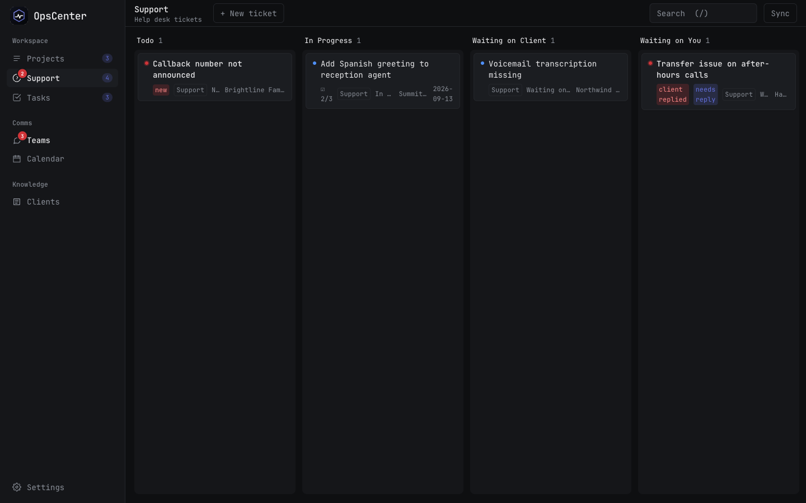
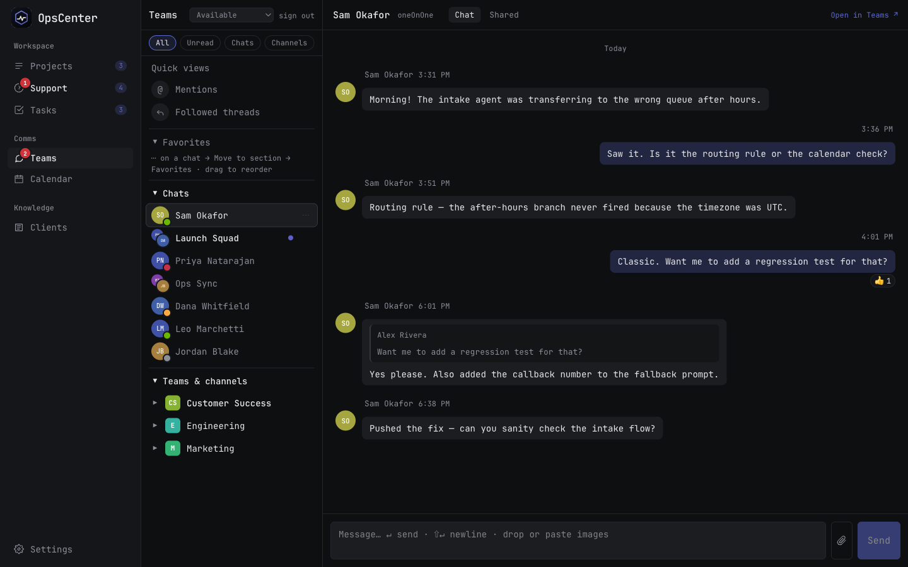
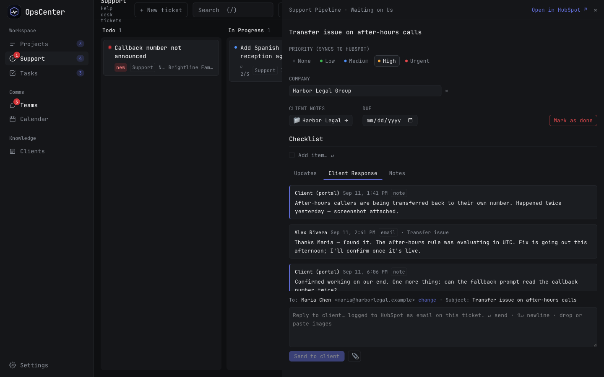
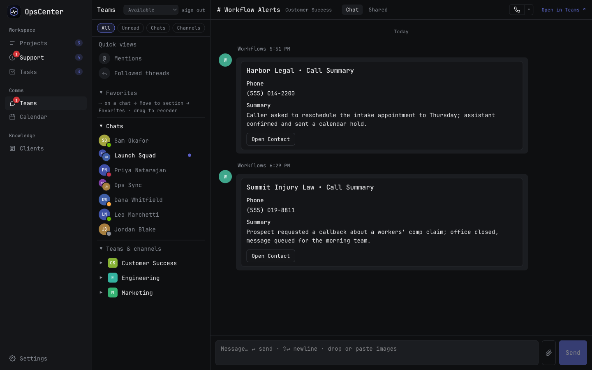
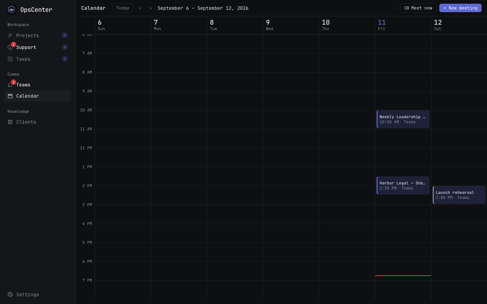
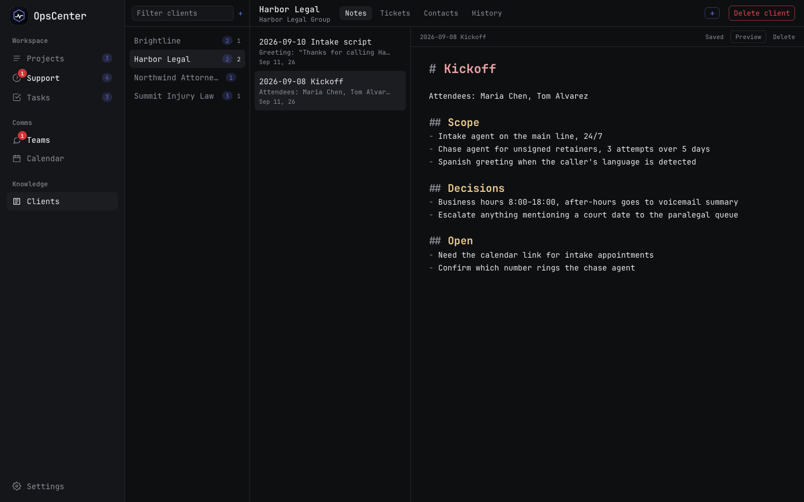

# OpsCenter



A self-hosted, single-user **command center** for people who live in HubSpot and Microsoft Teams all day and want one fast, keyboard-driven place instead of five browser tabs.

- **Kanban board** mirrored two-way with HubSpot tickets (drag a card → stage changes in HubSpot; HubSpot changes → card moves). Projects and Support each get their own columns.
- **Client responses + team notes** written straight onto the HubSpot ticket, with attachments rendered inline.
- **Microsoft Teams** chats & channels (read, send, react, quote-reply, photos, adaptive cards), presence, per-conversation notification levels, PWA notifications.
- **Teams calls and meetings in-app** (Azure Communication Services): a Teams-style call window with pre-join device check, gallery, chat, screen share.
- **Calendar** week view with Join / Accept / Meet now / New Teams meeting.
- **Client notes** stored as plain Markdown in an Obsidian vault folder — edit in either tool. Pin the ones you keep coming back to, open any note in its own window, and reach them from the ticket that needs them.
- Linear-style dark UI, installable as a PWA, runs as a background service.



> Personal tool, opinionated, no multi-user auth. Runs on your machine against your own HubSpot + Microsoft 365 credentials. Nothing leaves your box except calls to those APIs.

## Screenshots

*(demo data — `DEMO=1`)*

| Support board | Ticket panel: client thread + reply |
|---|---|
|  |  |

| Teams chat | Channel with bot cards |
|---|---|
|  |  |

| Calendar | Client notes (Markdown, Obsidian-compatible) |
|---|---|
|  |  |

## Try it without credentials

```sh
DEMO=1 DB_PATH=data/demo.db NOTES_DIR=/tmp/demo-notes npm run dev
```

Demo mode swaps HubSpot and Microsoft Graph for fixture data (fake tickets, chats, channels, calendar) and seeds a throwaway SQLite file. Everything in the UI works except real sends.

## Stack

SvelteKit 2 (Svelte 5 runes) · TypeScript · Tailwind 4 · SQLite (`better-sqlite3`) · CodeMirror 6 · Microsoft Graph · HubSpot CRM API. One Node process.

## Run

Node 22+.

```sh
cp .env.example .env     # fill in HubSpot service key, Teams app ids, notes folder
npm install
npm run dev              # http://localhost:5173
```

Production:

```sh
npm run build && npm start    # http://localhost:3000
```

### Background service

**macOS**

```sh
sed "s#__HOME__#$HOME#g" deploy/com.opscenter.plist > ~/Library/LaunchAgents/com.opscenter.plist
launchctl bootstrap gui/$(id -u) ~/Library/LaunchAgents/com.opscenter.plist
```

Then open http://localhost:3000 in Chrome/Brave/Safari → *Install app* / *Add to Dock*. After code changes: `npm run deploy`.

**Linux** — see `deploy/opscenter.service` (systemd user unit).

## Configuration

Everything is in `.env` (see `.env.example`).

| Var | What |
|---|---|
| `HUBSPOT_TOKEN` | HubSpot **service key** (or private-app token). Scopes: `tickets`, `crm.objects.companies.read`, `crm.objects.contacts.read`, `crm.objects.owners.read`, `sales-email-read`, `files.read`, `files.write` |
| `HUBSPOT_OWNER_ID` | your owner id — only tickets assigned to you are mirrored |
| `HUBSPOT_PORTAL_ID`, `HUBSPOT_APP_HOST` | for "Open in HubSpot" links |
| `HUBSPOT_PORTAL_SOURCE` | how to recognise notes created by your client portal (they show under *Client Response*) |
| `HUBSPOT_WAITING_ON_ME` | regex of stage labels meaning "ball in my court" |
| `NOTES_DIR` | folder with one sub-folder per client of `.md` notes (an Obsidian vault works) |
| `TEAMS_CLIENT_ID`, `TEAMS_TENANT_ID` | Entra app registration (public client, PKCE, redirect `http://localhost:3000/auth/teams/callback`) |
| `TEAMS_REDIRECT_URI` | OAuth redirect, default `http://localhost:3000/auth/teams/callback` — must match the Entra app |
| `TEAMS_CLIENT_SECRET` | optional — enables the app-only presence session so you show *Available* without the Teams client (`Presence.ReadWrite.All` application permission) |
| `CALLS_ENGINE` | `acs` places calls and joins meetings inside OpsCenter; `deeplink` hands them to the Teams app |
| `ACS_CONNECTION_STRING` | Azure Communication Services resource, needed for `CALLS_ENGINE=acs` |
| `APP_HOST` | optional — the hostname when served from a server instead of loopback (e.g. behind `tailscale serve`); writes must then come from exactly `https://APP_HOST` |
| `DB_PATH` | SQLite file, default `data/opscenter.db` |
| `DEMO` | optional — `1` serves built-in demo data instead of HubSpot / Microsoft |

Teams scopes are requested dynamically at sign-in; only `ChannelMessage.Read.All` needs admin consent.

## How it works

See [ARCHITECTURE.md](ARCHITECTURE.md).

## License

MIT — see [LICENSE](LICENSE).
